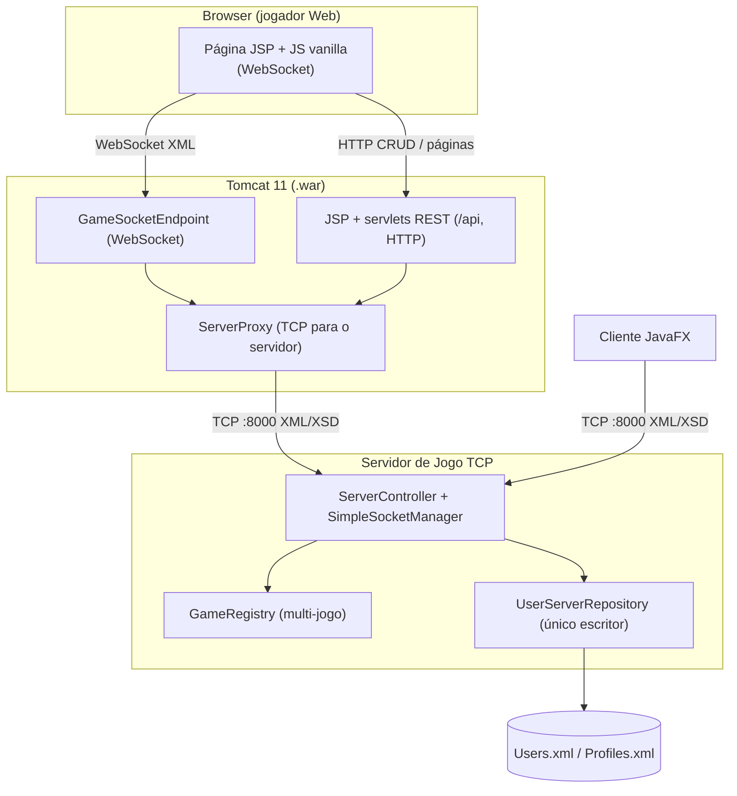
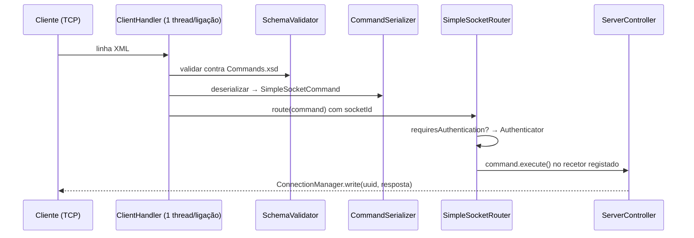

# Dots and Boxes — Relatório do Projeto (2ª Entrega)

**Instituto Superior de Engenharia de Lisboa**  
**Licenciatura em Engenharia Informática e Multimédia**  
**Unidade Curricular:** Infraestruturas Computacionais Distribuídas  
**Ano Letivo:** 2025/2026

**Autores:**

| Nome          | Número de Aluno |
| ------------- | --------------- |
| Andre Fonseca | 39758           |
| Daniel Santos | 32078           |

---

## Índice

1. [Introdução](#1-introdução)
2. [Descrição do Jogo](#2-descrição-do-jogo)
3. [Arquitetura do Sistema (TP02)](#3-arquitetura-do-sistema-tp02)
4. [Jogos Concorrentes e Temporizador](#4-jogos-concorrentes-e-temporizador)
5. [A Ponte Web ↔ Servidor](#5-a-ponte-web--servidor)
6. [Modelo de Domínio e Persistência](#6-modelo-de-domínio-e-persistência)
7. [Protocolo de Comunicação (XML/XSD)](#7-protocolo-de-comunicação-xmlxsd)
8. [Camada Web e Quadro de Honra](#8-camada-web-e-quadro-de-honra)
9. [Concorrência e Robustez](#9-concorrência-e-robustez)
10. [Padrões de Desenho](#10-padrões-de-desenho)
11. [Empacotamento, Build e Execução](#11-empacotamento-build-e-execução)
12. [Segurança e Compatibilidade](#12-segurança-e-compatibilidade)
13. [Limitações e Trabalho Não Implementado](#13-limitações-e-trabalho-não-implementado)
14. [Conclusão](#14-conclusão)
15. [Anexos](#anexos)

---

## 1. Introdução

Na primeira entrega foi desenvolvida uma aplicação cliente-servidor de _Dots and
Boxes_ com um servidor TCP concorrente, um protocolo de comandos em XML validado
por XSD e um cliente gráfico em JavaFX. Esta segunda entrega **estende o sistema
para a _World Wide Web_**: além do cliente JavaFX, passa a existir uma
**alternativa Web** (JavaServer Pages + Jakarta WebSocket sobre Apache Tomcat 11,
em JDK 25) que coexiste com o cliente desktop. Um jogador no browser pode jogar
contra um jogador na GUI.

Os princípios que guiaram a evolução foram a **continuidade** (o cliente JavaFX
mantém-se funcional, com alterações mínimas no servidor), a **interoperabilidade**
(um único protocolo XML/XSD partilhado por todos os transportes) e o
**minimalismo** (sem bibliotecas externas além das fornecidas pelo contentor).

Este relatório descreve a arquitetura resultante, o suporte a múltiplos jogos em
simultâneo com temporizador de jogada, a ponte entre o browser e o servidor de
jogo, o modelo de domínio e persistência, a camada Web (incluindo o quadro de
honra), as correções de concorrência efetuadas, e as decisões de empenho,
segurança e empacotamento. As funcionalidades não implementadas são também
documentadas de forma transparente.

---

## 2. Descrição do Jogo

_Dots and Boxes_ é um jogo de lápis e papel para dois jogadores. O tabuleiro é
uma grelha de pontos (por omissão 4×4 pontos → 3×3 caixas). Em cada turno, um
jogador coloca uma linha entre dois pontos adjacentes; ao fechar o quarto lado de
uma caixa, conquista-a e joga de novo (turno extra). O jogo termina quando todas
as linhas estão colocadas; vence quem tiver mais caixas (ou empate).

---

## 3. Arquitetura do Sistema (TP02)

> **Em resumo:** dois processos — um servidor de jogo TCP que detém todo o estado
> e é o único escritor da persistência, e uma aplicação Web em Tomcat que serve de
> ponte para o browser. Os três transportes (TCP, HTTP e WebSocket) partilham um
> único protocolo: o mesmo vocabulário XML validado por `Commands.xsd`.

A solução é um **split em dois processos por estilo de interação**:

- O **servidor de jogo TCP** (o servidor da 1ª entrega, estendido) detém todo o
  estado de jogo e é o **único escritor** de `Users.xml`/`Profiles.xml`. Serve
  tanto clientes JavaFX como a camada Web — para o servidor, todos os clientes
  são apenas `SimpleSocket`.
- A **aplicação Web (`.war`) em Tomcat** rende a interface em JSP, faz a ponte do
  _gameplay_ do browser via **WebSocket** e trata as operações de utilizador
  (registo, perfil, quadro de honra) por **servlets REST** sobre HTTP.



**Os três transportes, um só protocolo.** O mesmo vocabulário de comandos XML
(validado por `Commands.xsd`) viaja sobre: TCP/XML (porta 8000, clientes JavaFX e
proxies do Tomcat); HTTP (páginas JSP e servlets `/api/*`); e WebSocket (gameplay
do browser, transportando as mesmas mensagens XML). Isto satisfaz o requisito de
"múltiplos protocolos", mantendo o XML/XSD como protocolo comum e obrigatório.

| Nó               | Tipo                  | Responsabilidades                                                                |
| ---------------- | --------------------- | -------------------------------------------------------------------------------- |
| Servidor de jogo | Autónomo, concorrente | Lógica multi-jogo, autenticação, persistência (único escritor), encaminhamento   |
| Cliente JavaFX   | _Fat client_          | Inalterado em estrutura; liga por TCP                                            |
| Camada Web       | Ponte + thin client   | JSP; proxy WebSocket de gameplay; servlets REST (proxy CRUD). Sem lógica de jogo |
| Browser          | _Thin client_         | HTML/CSS/JS vanilla; HTTP (páginas/CRUD) + WebSocket (gameplay)                  |

### 3.1 Camadas e pacotes

O código organiza-se em pacotes `pt.isel.icd.*` que mapeiam diretamente as
camadas arquiteturais. O **núcleo de comunicação e domínio é partilhado** entre o
servidor, o cliente JavaFX e a camada Web; só a fronteira (UI/transporte) difere.

| Pacote               | Camada                   | Responsabilidade                                                                       |
| -------------------- | ------------------------ | -------------------------------------------------------------------------------------- |
| `pt.isel.icd` (raiz) | Orquestração             | _Bootstrap_ e controladores (`ServerApplication`/`ServerController`, lado cliente)     |
| `communication`      | Transporte + _dispatch_  | `SimpleSocket`, `ClientHandler`, `SimpleSocketManager`/`Router`, `SchemaValidator`     |
| `serialization`      | Protocolo                | (De)serialização XML via DOM (`CommandSerializer`, `CommandRegistry`, `XmlHelper`)     |
| `game.logic`         | Domínio (puro)           | Regras do jogo sem I/O (`Board`, `Game`, `Line`, `Dot`, `Player`, `GameState`)         |
| `game.management`    | Aplicação (jogo)         | Comandos de jogo + estado multi-jogo (`GameRegistry`, `GameSession`)                   |
| `user.logic`         | Domínio (utilizador)     | `User`, `Profile`                                                                      |
| `user.management`    | Aplicação + persistência | Comandos de utilizador, `Authenticator`, `UserServerRepository` (único escritor)       |
| `database`           | Persistência             | Acesso aos ficheiros XML (`XmlFileStore`)                                              |
| `ui` (+ subpacotes)  | Cliente JavaFX           | Vistas e controladores MVC (auth, game, menu, profile)                                 |
| `web`                | Camada Web (Tomcat)      | `GameSocketEndpoint`, `ServerProxy`, `GameServerGateway`, servlets REST, configurators |

### 3.2 Pipeline de comandos no servidor

Todo o protocolo assenta no **padrão _Command_**: cada mensagem é um
`SimpleSocketCommand` que se sabe (de)serializar e executar. No servidor, cada
ligação tem **uma _thread_ daemon dedicada** (`ClientHandler`) que corre o mesmo
ciclo, seja a origem um cliente JavaFX ou um `ServerProxy` do Tomcat — é isto que
torna os transportes indistinguíveis para a lógica de jogo.



Passos: (1) `ClientHandler` lê uma linha (uma mensagem = uma linha); (2)
`SchemaValidator` valida-a contra `Commands.xsd` — XML inválido é descartado sem
derrubar a ligação; (3) `CommandSerializer` desserializa para o comando concreto;
(4) o comando é carimbado com o `socketId` da ligação; (5) o `SimpleSocketRouter`
procura o controlador registado para aquele tipo e, se o comando o exigir,
verifica a autenticação via `Authenticator` antes de injetar o recetor e chamar
`execute()`. As respostas e _pushes_ assíncronos saem por
`ConnectionManager.write(uuid, …)`, endereçados ao destinatário pelo `UUID` do
socket. A lista de sockets é uma `CopyOnWriteArrayList`, segura para o acesso
concorrente de múltiplas _threads_ de ligação.

---

## 4. Jogos Concorrentes e Temporizador

Na 1ª entrega o servidor suportava apenas um jogo global. No TP02 isto vive todo
no servidor (os clientes apenas passam a transportar um `gameId`).

### 4.1 GameRegistry e GameSession

O `GameRegistry` substitui o `Game` único. Mantém um `Map<String, GameSession>`
(indexado por `gameId`), uma fila de emparelhamento e um
`ScheduledExecutorService` para os temporizadores. Cada `GameSession` agrupa o
`Game`, os `UUID` dos dois sockets participantes, os marcadores e o instante de
início. Um participante pode estar em vários jogos em simultâneo; o estado é
isolado por `gameId`. O `gameId` viaja como texto (UUID) no protocolo, mas é
tratado de forma opaca pelos clientes.

### 4.2 Emparelhamento

O comando `JoinGame` coloca o participante na fila; com dois à espera, é criada
uma `GameSession` já iniciada e enviado `JoinGameResponse` (com `gameId` e
marcador) a ambos. O primeiro a entrar fica com o marcador `A` e joga primeiro.
Como o cliente JavaFX e o proxy Web são, ambos, clientes TCP, o emparelhamento
não distingue a origem — daí o jogo entre GUI e Web ser automático.

### 4.3 Temporizador de 30 segundos e forfait

A cada início de turno é agendada uma tarefa a 30 segundos (configurável por
`-Ddab.turn.timeout.seconds`, útil em testes). Uma jogada válida cancela e
reinicia o temporizador. Ao expirar, o jogo é **perdido por forfait**: o jogador
que não jogou perde, o adversário ganha, e é enviado `GameOver` com
`reason=TIMEOUT`. O servidor é a autoridade de tempo; o browser apenas mostra uma
contagem decrescente visual.

**Corrida jogada‑vs‑timeout.** Como o disparo do temporizador corre numa thread
do agendador e uma jogada pode chegar no mesmo instante, todas as transições de
uma sessão (jogada, timeout, saída, desligação) ocorrem sob um **lock por sessão**
(`synchronized(session)`). Cada agendamento usa um **_token_ de turno**: quando o
timeout dispara, só é válido se o _token_ ainda for o atual — uma jogada que
entretanto reiniciou o temporizador terá avançado o _token_, tornando o disparo
obsoleto e inofensivo. Uma _flag_ `ended` garante que o jogo termina uma só vez.

---

## 5. A Ponte Web ↔ Servidor

O browser não abre sockets TCP; fala HTTP e WebSocket. A camada Web detém o socket
TCP **do lado do servidor** e faz a ponte para o servidor de jogo. Como o servidor
continua a falar só com `SimpleSocket`, **não foi necessário refatorar o servidor**.

### 5.1 ServerProxy

O `ServerProxy` é um pequeno cliente TCP do servidor de jogo, do lado do Tomcat.
É um relay quase transparente do protocolo XML linha-a-linha: uma mensagem =
uma linha. Para o servidor, um `ServerProxy` é indistinguível de um cliente
JavaFX.

### 5.2 Gameplay: WebSocket persistente

O `GameSocketEndpoint` (`@ServerEndpoint("/game")`) mantém **um WebSocket por
utilizador Web autenticado**. No `onOpen`, lê o utilizador da `HttpSession`
(associada ao handshake por um `Configurator`), abre **um `ServerProxy`
persistente**, autentica-o em nome do utilizador (com as credenciais da sessão) e
arranca uma thread leitora que reencaminha cada linha do servidor para o
WebSocket. O `onMessage` reencaminha o XML do browser para o socket TCP. Um único
WebSocket transporta todos os jogos simultâneos do utilizador, multiplexados por
`gameId`. O browser constrói/lê o XML com `DOMParser`/`XMLSerializer` nativos.

### 5.3 CRUD: ligações efémeras por pedido

As operações de utilizador (login, registo, perfil, quadro de honra) são tratadas
por servlets REST que, **por cada pedido HTTP**, abrem um `ServerProxy`
**efémero**, autenticam-no se necessário, enviam o comando, leem a resposta e
fecham. Como uma ligação CRUD nunca entra num jogo, não recebe _pushes_
assíncronos — a troca é um pedido/resposta limpo.

### 5.4 Porquê persistente no gameplay e por‑pedido no CRUD

Esta é uma decisão de desenho deliberada, e não uma simplificação:

- **O gameplay é persistente** porque (1) o servidor envia _pushes_ assíncronos
  (jogada do adversário, fim de jogo, timeout) que exigem uma ligação aberta com
  uma thread leitora; (2) a **identidade** do jogador no servidor está associada
  ao **id do socket** — uma `GameSession` guarda os `UUID` dos participantes;
  reabrir a ligação a cada jogada geraria um novo id e perderia a participação;
  (3) reautenticar e refazer o _handshake_ TCP a cada jogada acrescentaria
  latência ao ciclo de tempo real.
- **O CRUD é por pedido** porque é genuinamente sem estado (pedido/resposta sem
  _pushes_); uma ligação nova que nunca entra em jogo dá uma troca sem
  interferência de mensagens de jogo (evitando ter de correlacionar respostas com
  _pushes_ na mesma ligação); e dispensa gerir o ciclo de vida de ligações
  persistentes para operações pouco frequentes.

O servidor tolera, para o mesmo utilizador Web, **dois sockets autenticados em
simultâneo** (o proxy de gameplay persistente + um proxy CRUD efémero), porque a
autenticação é mantida por id de socket. É também por isto que a `HttpSession`
guarda a palavra‑passe: cada proxy efémero tem de se autenticar. O custo do CRUD
por pedido (handshake + autenticação por operação) é negligenciável à escala do
projeto; uma _pool_ de ligações seria a otimização natural, mas desnecessária.

---

## 6. Modelo de Domínio e Persistência

### 6.1 Perfil estendido e migração

O `Profile` (record) foi estendido com novos campos:

| Campo novo        | Tipo     | Finalidade                                              |
| ----------------- | -------- | ------------------------------------------------------- |
| `fullName`        | `String` | Nome completo (mostrado no perfil e no quadro de honra) |
| `preferredColor`  | `String` | Cor de fundo preferida do ecrã de jogo (`#RRGGBB`)      |
| `totalGames`      | `int`    | Jogos concluídos (para o tempo médio)                   |
| `totalTimeMillis` | `long`   | Tempo de jogo acumulado (médio = total/totalGames)      |

A `nationality` passa a ser um código **ISO 3166‑1 alfa‑2** (ex.: `PT`), do qual
se deriva a bandeira. Perfis antigos (formato da 1ª entrega, sem os campos novos)
são **migrados ao carregar**, recebendo valores por omissão (`fullName=""`,
`preferredColor="#FFFFFF"`, contadores a `0`); na primeira gravação o ficheiro
passa ao novo formato.

### 6.2 Tempo de jogo

Quando uma `GameSession` termina, o servidor calcula `duração = fim − início` e,
para cada participante autenticado, incrementa `totalGames` e soma a duração a
`totalTimeMillis`. Isto fornece o **tempo médio** usado como critério de desempate
no quadro de honra.

### 6.3 Persistência de escritor único (Design A)

O **servidor de jogo** é o único processo que escreve `Users.xml`/`Profiles.xml`
(via `UserServerRepository`/`XmlFileStore`). A camada Web faz todas as operações
CRUD **através do servidor** (os servlets nunca tocam nos ficheiros). Muitos
leitores são aceitáveis; um único escritor evita atualizações perdidas. O quadro
de honra é derivado de `Profiles.xml`.

---

## 7. Protocolo de Comunicação (XML/XSD)

O envelope `<Command><NomeDoComando>…</NomeDoComando></Command>` e a serialização
DOM mantêm‑se. As alterações são aditivas e refletidas no `Commands.xsd`.

**Identificação de jogo.** Os comandos de jogo passam a transportar `gameId`:
`JoinGameResponse`, `PlaceLine`, `PlaceLineResponse`, `LeaveGame`,
`LeaveGameResponse` e `GameOver`. O `GameOver` ganha ainda um campo `reason`
(`COMPLETED` | `TIMEOUT`) para a interface explicar um forfait.

**Comandos novos/estendidos do TP02:**

| Comando                          | Direção            | Campos                                                                                               |
| -------------------------------- | ------------------ | ---------------------------------------------------------------------------------------------------- |
| `CreateUser` (estendido)         | Cliente → Servidor | `username`, `password`, `fullName?`, `photo?`                                                        |
| `UpdateUser` (estendido)         | Cliente → Servidor | `fullName`, `nationality`, `age`, `photo`, `preferredColor`                                          |
| `ReadUserProfileResponse` (est.) | Servidor → Cliente | + `fullName`, `preferredColor`, `totalGames`, `totalTimeMillis`                                      |
| `HonorBoardCommand`              | Cliente → Servidor | _(nenhum)_                                                                                           |
| `HonorBoardResponseCommand`      | Servidor → Cliente | lista de `entry` (username, fullName, nationality, photo, wins, losses, totalGames, totalTimeMillis) |

Todo o XML de entrada (de clientes GUI e de proxies) é validado contra o
`Commands.xsd` por `SchemaValidator`, carregado do _classpath_. Mensagens
malformadas são rejeitadas.

---

## 8. Camada Web e Quadro de Honra

A camada Web segue o padrão **MVC / Model 2**: servlets e o endpoint WebSocket são
controladores; as JSP são vistas que rendem com **EL** (sem JSTL). O gameplay é em
tempo real por WebSocket; as operações de utilizador são pedido/resposta por HTTP.
Usa‑se apenas **JavaScript vanilla** (`WebSocket`, `fetch`, `DOMParser`) e CSS
escrito à mão.

### 8.1 Páginas JSP

| Página         | Conteúdo                                                                                               |
| -------------- | ------------------------------------------------------------------------------------------------------ |
| `index.jsp`    | Encaminha para o lobby (autenticado) ou login.                                                         |
| `login.jsp`    | Início de sessão (via `fetch` para `/api/session`).                                                    |
| `register.jsp` | Registo (nickname, password, nome completo, foto via `FileReader`/Base64).                             |
| `lobby.jsp`    | Jogar, perfil, quadro de honra, logout.                                                                |
| `profile.jsp`  | Editar foto, nome completo, nacionalidade, idade e cor de fundo.                                       |
| `game.jsp`     | Tabuleiro de um jogo, pontuação, turno, contagem de 30s; fundo com `preferredColor`. Abre o WebSocket. |
| `honor.jsp`    | Quadro de honra com fotos e bandeiras, ordenado.                                                       |

### 8.2 Recursos REST

| Servlet (recurso)    | Método + caminho       | Função                                 | Sucesso |
| -------------------- | ---------------------- | -------------------------------------- | ------- |
| `SessionServlet`     | `POST /api/session`    | Login (guarda na `HttpSession`)        | 201     |
|                      | `GET /api/session`     | Utilizador atual (ou 401)              | 200     |
|                      | `DELETE /api/session`  | Logout                                 | 204     |
| `UsersServlet`       | `POST /api/users`      | Registo (`CreateUser`)                 | 201/409 |
|                      | `GET /api/users/me`    | Perfil próprio (`ReadUserProfile`)     | 200     |
|                      | `PUT /api/users/me`    | Editar perfil (corpo XML, foto Base64) | 200     |
| `HonorBoardServlet`  | `GET /api/honor-board` | Quadro de honra ordenado               | 200     |
| `GameSocketEndpoint` | `ws /game`             | Proxy de gameplay (não REST)           | —       |

A autenticação usa `HttpSession` (API com estado, por desenho); as JSP usam
`fetch` para `PUT`/`DELETE` (os formulários HTML só suportam GET/POST). A foto
viaja como Base64 dentro do corpo XML, evitando _multipart_.

### 8.3 Quadro de honra

O `honor.jsp` chama `GET /api/honor-board`. A ordenação (feita no servidor) é:
**vitórias descendente**; em caso de empate, **tempo médio de jogo ascendente**;
jogadores sem jogos ficam por último dentro do mesmo número de vitórias (não têm
tempo médio definido). As bandeiras são derivadas do código ISO alfa‑2 como
_regional indicator emoji_ (ex.: `PT` → 🇵🇹); as fotos vêm de Base64
(``).

---

## 9. Concorrência e Robustez

O suporte a múltiplas ligações em simultâneo (mais visível com a ponte Web)
expôs e motivou a correção de problemas de concorrência pré-existentes:

| Problema                                                                                                                                              | Correção                                                                              |
| ----------------------------------------------------------------------------------------------------------------------------------------------------- | ------------------------------------------------------------------------------------- |
| `SimpleSocketRouter` guardava o comando em curso num **campo partilhado** entre threads, misturando comandos de ligações diferentes sob concorrência. | Passou a usar uma **variável local** em `route()`.                                    |
| `Validator` (XSD) único partilhado por todas as ligações — não é thread‑safe (corrompia o estado).                                                    | `SchemaValidator` guarda o `Schema` (imutável) e cria um `Validator` **por chamada**. |
| `UserServerRepository` mutava/iterava as listas em concorrência (`ConcurrentModificationException`).                                                  | Métodos **`synchronized`**.                                                           |
| `authenticatedUsers` e a lista de sockets acedidos por várias threads.                                                                                | `ConcurrentHashMap` e `CopyOnWriteArrayList`.                                         |

**Limpeza ao desligar.** Quando um socket se desliga (incluindo o fecho abrupto de
um browser), o `ClientHandler` encaminha um `DisconnectedCommand` com o id do
socket; o `ServerController` (que implementa `DisconnectionListener`) remove‑o da
fila de emparelhamento e termina os jogos em que participava, avisando o
adversário. Isto resolve o problema de "fantasmas" no emparelhamento.

O servidor mantém‑se concorrente (uma thread por ligação). O estado de jogo é
volátil (em memória); a durabilidade visa o quadro de honra (perfis).

---

## 10. Padrões de Desenho

| Padrão               | Onde                                    | Descrição                                                                      |
| -------------------- | --------------------------------------- | ------------------------------------------------------------------------------ |
| **Command**          | `SimpleSocketCommand` e subclasses      | Cada comando encapsula um pedido/resposta, sabe serializar‑se e executar‑se.   |
| **Observer**         | `GameEventListener`                     | Callbacks de eventos do servidor para os controllers de UI.                    |
| **MVC / Model 2**    | UI JavaFX e camada Web (servlets + JSP) | Separação Model/View/Controller.                                               |
| **Factory/Registry** | `CommandRegistry` + `CommandSerializer` | Fábricas que instanciam comandos a partir de XML (deserialização polimórfica). |
| **Mediator**         | `ClientController` / `ServerController` | Centralizam a comunicação rede ↔ UI/lógica.                                    |
| **Repository**       | `UserServerRepository`                  | Abstrai o acesso a utilizadores/perfis.                                        |
| **Proxy**            | `ServerProxy`                           | Representa, no Tomcat, uma ligação ao servidor de jogo (ponte para o browser). |

---

## 11. Empacotamento, Build e Execução

O projeto mantém‑se **um único módulo Maven**, produzindo **um `.war`** mais as
duas classes `main` (servidor e cliente). Alterações principais ao `pom.xml`:

- `maven.compiler.release`: `17` → **`25`**.
- APIs `jakarta.servlet`, `jakarta.websocket` (e `-client`) em escopo **`provided`**
  (fornecidas pelo Tomcat; não empacotadas).
- O **JavaFX é excluído do `.war`** (`packagingExcludes`), mantendo‑se para
  `mvn javafx:run`. O **código‑fonte é embebido** em `WEB-INF/project/` para que o
  `.war` seja importável num IDE com fonte editável.

**Recursos configuráveis (resolvendo caminhos relativos ao CWD):** os XSD são
carregados do _classpath_; o diretório de dados é configurável por
`-Ddab.data.dir`; a camada Web lê `dab.server.host`/`dab.server.port` (propriedade
de sistema → `context-param` → `localhost:8000`).

**Execução (dois processos):**

```sh
# Servidor de jogo (autónomo)
mvn exec:java -Dexec.mainClass=pt.isel.icd.ServerApplication
# Cliente JavaFX (liga a localhost:8000)
mvn javafx:run
# Aplicação Web: implantar o .war (mvn package) num Tomcat 11
```

**Docker Compose (execução local).** Foram criados `docker/Dockerfile.server`,
`docker/Dockerfile.web` (ambos _multi-stage_) e um `docker-compose.yml` que arranca
os dois serviços: `game-server` (porta 8000, dados num volume `dab-data`) e `web`
(Tomcat 11 com o `.war` como `ROOT`, porta 8080), injetando o host/porta do
servidor por `CATALINA_OPTS`. A GUI JavaFX não é containerizada (precisa de
_display_) e liga a `localhost:8000`, demonstrando o jogo entre modos.

---

## 12. Segurança e Compatibilidade

- **Sessões Web:** `HttpSession` com cookies; o WebSocket reutiliza a sessão
  autenticada e rejeita _handshakes_ não autenticados.
- **Credenciais na sessão:** como as palavras‑passe são em texto simples
  (herdado), a sessão guarda‑as para os proxies se autenticarem. Limitação
  documentada (melhoria proposta: _hashing_ com `MessageDigest`).
- **Validação de entrada:** XSD em cada mensagem; a EL escapa o HTML de saída,
  mitigando XSS em campos livres (ex.: `fullName`).
- **Transporte:** HTTP/WS/TCP em claro; HTTPS/WSS seria uma melhoria.
- **Compatibilidade de browsers:** o cliente Web usa funcionalidades amplamente
  suportadas (HTML5, CSS escrito à mão, `fetch`, `WebSocket`, `DOMParser`,
  `<input type="color">`, _regional indicator emoji_), compatíveis com Chrome,
  Firefox, Edge e Safari recentes.

---

## 13. Limitações e Trabalho Não Implementado

Por transparência, listam‑se as funcionalidades previstas que **não** ficaram
implementadas nesta entrega:

- **Pesquisa de adversários por nome (AutoComplete).** Chegou a ser implementada
  (comandos `SearchUsers`, endpoint `GET /api/users?name=`, `<datalist>` no
  lobby), mas foi **revertida** por divergência quanto ao fluxo pretendido (a
  pesquisa deveria operar sobre jogadores presentes no lobby e permitir escolher
  adversário, o que exigiria presença/sala de espera e emparelhamento dirigido —
  fora do âmbito desta entrega).
- **Registo de auditoria (`audit.log`).** Não implementado.
- **Persistência atómica e recuperação.** As escritas continuam a ser diretas
  (sem ficheiro temporário + _move_ atómico) e não há backup `.bak` nem
  recuperação no arranque. O estado de jogo permanece volátil.
- **Segurança:** _hashing_ de palavras‑passe e HTTPS/WSS não foram implementados
  (limitações assumidas).

Outras notas: o `.war` requer dois processos a correr (servidor + Tomcat), o que
deve ser comunicado a quem avalia; a renderização das bandeiras por emoji depende
do sistema/_browser_.

---

## 14. Conclusão

A segunda entrega evoluiu o sistema de uma aplicação cliente‑servidor TCP/JavaFX
para uma solução que opera também na Web, **sem sacrificar o cliente desktop nem
o protocolo XML/XSD** que ambos partilham. O modelo de dois processos — servidor
de jogo TCP com estado e camada Web como ponte/cliente fino — permitiu reutilizar
o servidor quase sem alterações estruturais, resolvendo o acesso do browser a um
servidor TCP através de um proxy do lado do Tomcat.

Foram acrescentadas as capacidades centrais pedidas: **múltiplos jogos
concorrentes** com `gameId`, **temporizador de 30 s com forfait**, **perfis
estendidos** (nome completo, cor preferida, tempo de jogo) com **edição via REST
(Design A)**, e o **quadro de honra** ordenado com fotos e bandeiras. A construção
da ponte Web e dos testes de integração expôs problemas de **concorrência**
pré‑existentes (corrida no encaminhador, validador XSD não thread‑safe, repositório
não sincronizado), cuja correção tornou o servidor robusto sob carga de múltiplas
ligações — um dos contributos técnicos mais relevantes desta fase.

Permanecem limitações assumidas (auditoria, escrita atómica, _hashing_ de
palavras‑passe e transporte cifrado), bem como a pesquisa de adversários, que foi
ponderada e revertida. Ainda assim, o sistema cumpre os objetivos essenciais e
oferece uma base sólida e interoperável para evoluções futuras.

---

## Anexos

### Capturas de Ecrã (cliente JavaFX)

#### Ecrã de Login


#### Ecrã de Jogo — Início de Partida


#### Ecrã de Jogo — Partida em Curso


#### Ecrã de Perfil


> _Nota:_ as capturas da interface Web (login, lobby, jogo no browser, perfil e
> quadro de honra) podem ser acrescentadas a partir de `http://localhost:8080/`
> com a aplicação em execução.
