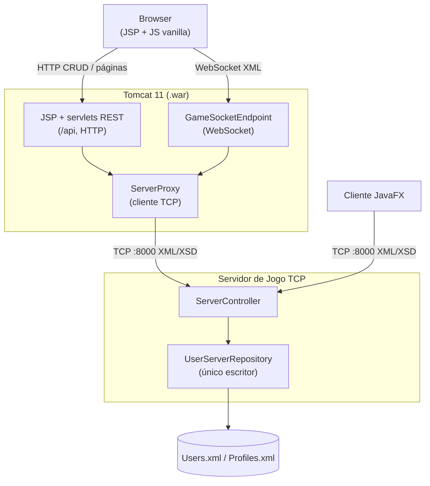

# Dots and Boxes. Relatório do Projeto (2ª Entrega)

**Instituto Superior de Engenharia de Lisboa**
**Licenciatura em Engenharia Informática e Multimédia**
**Unidade Curricular:** Infraestruturas Computacionais Distribuídas
**Ano Letivo:** 2025/2026

**Autores:**

| Nome          | Número de Aluno |
| ------------- | --------------- |
| Andre Fonseca | 39758           |
| Daniel Santos | 32078           |

---

## Índice

1. [Introdução](#1-introdução)
2. [Descrição do Jogo](#2-descrição-do-jogo)
3. [Arquitetura do Sistema](#3-arquitetura-do-sistema)
   - 3.1 [Visão Geral](#31-visão-geral)
   - 3.2 [Servidor](#32-servidor)
   - 3.3 [Cliente](#33-cliente)
   - 3.4 [Comunicação](#34-comunicação)
   - 3.5 [Camada Web (Servlets, JSP e WebSocket)](#35-camada-web-servlets-jsp-e-websocket)
4. [Modelo de Domínio](#4-modelo-de-domínio)
   - 4.1 [Lógica de Jogo](#41-lógica-de-jogo)
   - 4.2 [Gestão de Utilizadores](#42-gestão-de-utilizadores)
5. [Protocolo de Comunicação](#5-protocolo-de-comunicação)
   - 5.1 [Formato das Mensagens (XML)](#51-formato-das-mensagens-xml)
   - 5.2 [Validação com XSD](#52-validação-com-xsd)
   - 5.3 [Catálogo de Comandos](#53-catálogo-de-comandos)
6. [Padrões de Desenho](#6-padrões-de-desenho)
7. [Persistência de Dados](#7-persistência-de-dados)
8. [Interface Gráfica (JavaFX)](#8-interface-gráfica-javafx)
   - 8.1 [Navegação entre Vistas](#81-navegação-entre-vistas)
   - 8.2 [Descrição dos Ecrãs](#82-descrição-dos-ecrãs)
9. [Interface Web (Servlets e JSP)](#9-interface-web-servlets-e-jsp)
   - 9.1 [Páginas JSP](#91-páginas-jsp)
   - 9.2 [Recursos REST (Servlets)](#92-recursos-rest-servlets)
   - 9.3 [Gameplay por WebSocket](#93-gameplay-por-websocket)
   - 9.4 [Quadro de Honra](#94-quadro-de-honra)
10. [Instruções de Execução](#10-instruções-de-execução)
11. [Conclusão](#11-conclusão)

---

## 1. Introdução

O Dots and Boxes é um jogo clássico de lápis e papel para dois jogadores, onde o objetivo é fechar mais caixas do que o adversário. Este projecto tem como objetivo desenvolver uma aplicação cliente-servidor que permita a dois jogadores disputarem partidas em tempo real, utilizando conceitos aprendidos no âmbito da unidade curricular Infraestruturas Computacionais Distribuídas do curso de Licenciatura em Engenharia Informática e Multimédia do Instituto Superior de Engenharia de Lisboa.

Na primeira entrega foi desenvolvido um servidor TCP concorrente, um protocolo de comandos em XML validado por XSD e um cliente gráfico em JavaFX. Esta segunda entrega **estende o sistema para a _World Wide Web_**: além do cliente JavaFX, passa a existir uma **alternativa Web** — JavaServer Pages (JSP) e servlets sobre Apache Tomcat 11, com gameplay em tempo real por Jakarta WebSocket — que coexiste com o cliente desktop. Um jogador no browser pode inclusive jogar contra um jogador na GUI, porque ambos partilham o mesmo servidor e o mesmo protocolo XML/XSD.

O presente relatório descreve a arquitetura do sistema, o modelo de domínio, o protocolo de comunicação, os padrões de desenho utilizados, a persistência de dados e as duas interfaces implementadas (JavaFX e Web). Além disso, são fornecidas instruções para compilar e executar a aplicação, bem como uma conclusão que reflete sobre o desenvolvimento do projecto e as aprendizagens retiradas.

---

## 2. Descrição do Jogo

Dots and Boxes é um jogo de lápis e papel para dois jogadores. O tabuleiro consiste numa grelha de pontos (por omissão, 4×4 pontos, formando 3×3 caixas). Em cada turno, um jogador coloca uma linha horizontal ou vertical entre dois pontos adjacentes. Quando um jogador completa o quarto lado de uma caixa, essa caixa fica na sua posse e o jogador ganha um turno extra. O jogo termina quando todas as linhas estão colocadas; ganha o jogador com mais caixas.

**Regras implementadas:**

- Dois jogadores (marcadores `A` e `B`).
- Grelha configurável (padrão: 4×4 pontos → 3×3 caixas).
- Turno alternado; turno extra ao fechar uma caixa.
- O jogo termina quando o tabuleiro está cheio; empate se os pontos forem iguais.

---

## 3. Arquitetura do Sistema

### 3.1 Visão Geral

O sistema segue uma arquitetura **cliente-servidor** sobre TCP. O servidor gere a lógica de jogo, a autenticação e a persistência de dados. Cada cliente liga-se ao servidor, envia comandos (pedidos) e recebe comandos (respostas). A comunicação é feita através de mensagens XML, uma por linha, validadas contra um esquema XSD.

```
┌──────────────┐         TCP / XML           ┌──────────────────┐
│              │  ◄──────────────────────►   │                  │
│   Cliente    │       Comandos (XML)        │    Servidor      │
│  (JavaFX)    │                             │  (ServerSocket)  │
│              │  ◄──────────────────────►   │                  │
└──────────────┘                             └──────────────────┘
 UI / FXML                                    Lógica de Jogo
 ViewManager                                  Persistência de dados XML
 ClientController                             ServerController
```

Na 2ª entrega foi acrescentado um **segundo modo de acesso** — a camada Web — sem alterar este núcleo: para o servidor, o browser (via Tomcat) é apenas mais um cliente TCP. Esse modo é descrito em [3.5](#35-camada-web-servlets-jsp-e-websocket).

### 3.2 Servidor

O servidor (`ServerApplication`) é o ponto de entrada do lado do servidor. Trata-se de um **servidor concorrente**: para cada cliente que se liga, é criada uma thread dedicada (`ClientHandler`) que processa os seus pedidos de forma independente, permitindo que múltiplos clientes estejam ligados em simultâneo. O servidor é a fonte de verdade da lógica de jogo e serve **indistintamente** clientes JavaFX e a camada Web — ambos são, para ele, ligações `SimpleSocket`. Cria e liga as seguintes dependências:

| Componente            | Responsabilidade                                                                                                                                                |
| --------------------- | --------------------------------------------------------------------------------------------------------------------------------------------------------------- |
| `Server`              | Escuta no porto 8000 e aceita ligações TCP. Para cada ligação cria um `SimpleSocket` e lança um `ClientHandler` numa thread dedicada.                           |
| `ServerController`    | Hub de lógica do jogo. Processa todos os comandos recebidos (autenticação, criação de utilizadores, gestão de jogo). Implementa `Controller` e `Authenticator`. |
| `SimpleSocketManager` | Coordenador central. Regista sockets ligados, delega o encaminhamento de comandos ao `SimpleSocketRouter` e expõe métodos de escrita.                           |
| `SimpleSocketRouter`  | Despacha comandos. Mapeia a classe de cada comando ao controller correspondente, verifica autenticação e invoca `command.execute()`.                            |
| `ClientHandler`       | Thread de leitura por ligação. Lê linhas XML do socket, deserializa para comandos e encaminha-os pelo `SimpleSocketManager`.                                    |
| `SchemaValidator`     | Valida as mensagens XML de entrada contra o `Commands.xsd`.                                                                                                     |

### 3.3 Cliente

O cliente (`ClientApplication`) é um **fat client** — uma aplicação JavaFX autónoma que contém lógica de apresentação, validação local de dados (e.g., campos de registo) e mantém uma cópia local do estado do tabuleiro para efeitos de renderização. O servidor permanece a fonte de verdade para toda a lógica de jogo.

| Componente          | Responsabilidade                                                                                                                                                                      |
| ------------------- | ------------------------------------------------------------------------------------------------------------------------------------------------------------------------------------- |
| `ClientApplication` | Ponto de entrada da interface gráfica JavaFX. monta o pipeline de serialização, cria o `Client`, o `ClientController` e o `ViewManager`.                                              |
| `Client`            | Cria a ligação TCP ao servidor (localhost:8000), lança um `ClientHandler` para leitura e expõe `sendCommand()`.                                                                       |
| `ClientController`  | Mediador central. Mantém o estado de sessão (utilizador autenticado, jogo corrente) e traduz acções do UI em comandos de rede, bem como respostas do servidor em callbacks para o UI. |
| `ViewManager`       | Gestor de navegação. Carrega FXML, injecta dependências nos controllers e troca a `Scene` no `Stage`.                                                                                 |
| `GameEventListener` | Interface _observer_. define callbacks (`onAuthenticated`, `onGameJoined`, `onLinePlaced`, etc.) que os controllers de UI implementam.                                                |

### 3.4 Comunicação

A comunicação baseia-se num protocolo de **mensagens XML sobre TCP (porto 8000)**, uma mensagem por linha. O fluxo é:

1. O cliente serializa um comando para XML (`CommandSerializer.serialize()`).
2. A string XML é enviada como uma linha através da socket.
3. O servidor lê a linha, valida-a contra o XSD (`SchemaValidator`) e deserializa-a (`CommandSerializer.deserialize()`).
4. O `SimpleSocketRouter` encontra o controller associado ao tipo de comando, verifica autenticação se necessário, e executa o comando.
5. O servidor responde com um comando de resposta, seguindo o mesmo processo em sentido inverso.

De notar que o `SimpleSocket` abstrai toda a lógica de leitura/escrita de linhas, e o `CommandSerializer` é responsável por toda a serialização/deserialização, garantindo que os comandos são convertidos para XML e vice-versa de forma consistente, em ambos os lados (cliente e servidor).

### 3.5 Camada Web (Servlets, JSP e WebSocket)

A 2ª entrega introduz uma **alternativa Web** ao cliente JavaFX, organizada como um **split em dois processos**:

- O **servidor de jogo TCP** (o da 1ª entrega, estendido) detém todo o estado de jogo e é o **único escritor** de `Users.xml`/`Profiles.xml`.
- A **aplicação Web (`.war`) em Apache Tomcat 11** rende a interface em **JSP**, trata as operações de utilizador (login, registo, perfil, quadro de honra) por **servlets REST** sobre HTTP, e faz a ponte do _gameplay_ do browser por **WebSocket**.

Como o servidor continua a falar apenas com `SimpleSocket`, **não foi necessário refatorá-lo**: o browser não abre sockets TCP — fala HTTP e WebSocket com o Tomcat, que detém o socket TCP **do lado do servidor** e o reencaminha. Essa ponte é o **`ServerProxy`**, um pequeno cliente TCP do servidor de jogo, do lado do Tomcat, que faz de _relay_ quase transparente do protocolo XML linha-a-linha (uma mensagem = uma linha). Existem dois modos de utilização do proxy:

- **Gameplay (WebSocket persistente):** o `GameSocketEndpoint` (`@ServerEndpoint("/game")`) mantém **um WebSocket por utilizador Web autenticado**, ligado a um `ServerProxy` persistente. Uma _thread_ leitora reencaminha cada linha do servidor para o browser; o `onMessage` reencaminha o XML do browser para o servidor. É necessário ser persistente porque o servidor envia _pushes_ assíncronos (jogada do adversário, fim de jogo) e a identidade do jogador está ligada ao _id_ do socket.
- **CRUD (ligações efémeras):** cada operação de utilizador abre, **por pedido HTTP**, um `ServerProxy` efémero que se autentica se necessário, envia o comando, lê a resposta e fecha — uma troca pedido/resposta limpa, sem _pushes_.

Os **três transportes — TCP/XML, HTTP e WebSocket — partilham um só protocolo**: o mesmo vocabulário de comandos XML validado por `Commands.xsd`. Isto mantém o XML/XSD como protocolo comum e permite que um jogador no browser e um na GUI joguem um contra o outro.



---

## 4. Modelo de Domínio

### 4.1 Lógica de Jogo

| Classe         | Descrição                                                                                                                                                 |
| -------------- | --------------------------------------------------------------------------------------------------------------------------------------------------------- |
| `Game`         | Orquestra uma sessão de jogo. Mantém dois `Player`, um `Board`, o jogador corrente, o estado do ciclo de vida (`GameState`) e determina o vencedor.       |
| `Board`        | Representa a grelha. Regista as linhas colocadas (`Set<Line>`) e a posse das caixas (`PlayerMarker[][]`). Detecta o fecho de caixas ao colocar uma linha. |
| `Line`         | _Value object_ (record). Par imutável de dois `Dot` adjacentes (horizontal ou vertical). Normaliza a ordem para garantir igualdade consistente.           |
| `Dot`          | _Value object_ (record). Coordenada `(row, col)` no tabuleiro.                                                                                            |
| `Player`       | Contém um `PlayerMarker` e uma pontuação mutável (caixas conquistadas).                                                                                   |
| `PlayerMarker` | Enum com dois valores: `A` e `B`.                                                                                                                         |
| `GameState`    | Enum do ciclo de vida: `CLOSED` → `OPEN` → `STARTED` → `FINISHED`.                                                                                        |

### 4.2 Gestão de Utilizadores

| Classe                 | Descrição                                                                                                                   |
| ---------------------- | --------------------------------------------------------------------------------------------------------------------------- |
| `User`                 | Record com `username` (3–20 caracteres) e `password` (8–20 caracteres).                                                     |
| `Profile`              | Record com `username`, `fullName`, `nationality`, `age`, `photo` (Base64), `preferredColor`, `wins` e `losses`.             |
| `UserServerRepository` | Repositório em memória backed por `XmlFileStore`. CRUD de utilizadores e perfis, com persistência imediata em cada mutação. |
| `Authenticator`        | Interface que expõe `isAuthenticated(UUID socketId)`.                                                                       |

> **Nota (2ª entrega):** o `Profile` foi estendido com `fullName` e `preferredColor` (cor de fundo do ecrã de jogo, `#RRGGBB`), usados pela interface Web e pelo quadro de honra. Perfis no formato antigo são migrados ao carregar, recebendo valores por omissão.

---

## 5. Protocolo de Comunicação

### 5.1 Formato das Mensagens (XML)

Todas as mensagens seguem a estrutura:

```xml
<Command>
  <NomeDoComando>
    <!-- campos do comando -->
  </NomeDoComando>
</Command>
```

O elemento raiz é sempre `<Command>` e contém exatamente um elemento filho que identifica o tipo de comando. A serialização e deserialização são feitas com a DOM API (`javax.xml.parsers`), sem recurso a frameworks como JAXB. **Os mesmos comandos** são usados nos três transportes (TCP, HTTP e WebSocket): no browser, o JavaScript constrói e lê este XML com `DOMParser`/`XMLSerializer` nativos.

### 5.2 Validação com XSD

As mensagens são validadas contra os seguintes esquemas:

| Esquema        | Função                                                                                              |
| -------------- | --------------------------------------------------------------------------------------------------- |
| `Commands.xsd` | Define a estrutura de todos os tipos de comando trocados entre cliente e servidor.                  |
| `Users.xsd`    | Valida o ficheiro `Users.xml` de persistência (username: 3–20 chars, password: 8–20 chars).         |
| `Profiles.xsd` | Valida o ficheiro `Profiles.xml` de persistência (username, nationality, age, photo, wins, losses). |

### 5.3 Catálogo de Comandos

#### Gestão de Utilizadores

| Comando                    | Direcção           | Campos                                                                                                  | Descrição                                   |
| -------------------------- | ------------------ | ------------------------------------------------------------------------------------------------------- | ------------------------------------------- |
| `AuthenticateUser`         | Cliente → Servidor | `username`, `password`                                                                                  | Autenticação de um utilizador existente.    |
| `AuthenticateUserResponse` | Servidor → Cliente | `username`, `authenticated`                                                                             | Resultado da autenticação.                  |
| `CreateUser`               | Cliente → Servidor | `username`, `password`, `fullName?`, `photo?`                                                           | Registo de um novo utilizador.              |
| `CreateUserResponse`       | Servidor → Cliente | `username`, `created`                                                                                   | Resultado do registo.                       |
| `ReadUserProfile`          | Cliente → Servidor | _(nenhum)_                                                                                              | Pedido do perfil do utilizador autenticado. |
| `ReadUserProfileResponse`  | Servidor → Cliente | `hasProfile`, `username`, `fullName`, `nationality`, `age`, `photo`, `preferredColor`, `wins`, `losses` | Dados do perfil.                            |
| `UpdateUser`               | Cliente → Servidor | `fullName`, `nationality`, `age`, `photo`, `preferredColor`                                             | Atualização do perfil.                      |

#### Gestão de Jogo

| Comando             | Direção            | Campos                                                                | Descrição                                                       |
| ------------------- | ------------------ | --------------------------------------------------------------------- | --------------------------------------------------------------- |
| `JoinGame`          | Cliente → Servidor | _(nenhum)_                                                            | Pedido para entrar/criar um jogo.                               |
| `JoinGameResponse`  | Servidor → Cliente | `joined`, `gameId`, `marker`, `boardRows`, `boardCols`                | Resultado. Inclui o `gameId`, o marcador atribuído e dimensões. |
| `PlaceLine`         | Cliente → Servidor | `gameId`, `dot1Row`, `dot1Col`, `dot2Row`, `dot2Col`                  | Colocação de uma linha entre dois pontos.                       |
| `PlaceLineResponse` | Servidor → Cliente | `gameId`, `placed`, coordenadas, `boxesClosed`, `marker`, `extraTurn` | Resultado da jogada. indica se fechou caixas e turno extra.     |
| `LeaveGame`         | Cliente → Servidor | `gameId`                                                              | Pedido para abandonar o jogo.                                   |
| `LeaveGameResponse` | Servidor → Cliente | `gameId`, `left`                                                      | Confirmação de saída.                                           |
| `GameOver`          | Servidor → Cliente | `gameId`, `hasWinner`, `winnerMarker`, `scoreA`, `scoreB`, `reason`   | Notificação de fim de jogo com resultados.                      |

#### Quadro de Honra

| Comando                     | Direção            | Campos                                                                                 | Descrição                       |
| --------------------------- | ------------------ | -------------------------------------------------------------------------------------- | ------------------------------- |
| `HonorBoardCommand`         | Cliente → Servidor | _(nenhum)_                                                                             | Pedido do ranking de jogadores. |
| `HonorBoardResponseCommand` | Servidor → Cliente | lista de `entry` (username, fullName, nationality, photo, wins, losses, totalGames, …) | Ranking ordenado.               |

#### Eventos de Ligação

| Comando               | Descrição                                              |
| --------------------- | ------------------------------------------------------ |
| `ConnectedCommand`    | Evento interno disparado quando um cliente se liga.    |
| `DisconnectedCommand` | Evento interno disparado quando um cliente se desliga. |

> **Nota sobre autenticação:** Os comandos `AuthenticateUser` e `CreateUser` não requerem autenticação prévia. Todos os restantes comandos (jogo, perfil) são rejeitados pelo `SimpleSocketRouter` se o cliente ainda não estiver autenticado.
>
> **Nota sobre o `gameId` (2ª entrega):** com o suporte a múltiplos jogos em simultâneo, os comandos de jogo passam a transportar um `gameId` (UUID) que identifica a sessão. O `GameOver` ganha ainda um campo `reason` (`COMPLETED` | `TIMEOUT`).

---

## 6. Padrões de Desenho

O projecto faz uso dos seguintes padrões de desenho:

| Padrão                 | Onde é Aplicado                             | Descrição                                                                                                                                                          |
| ---------------------- | ------------------------------------------- | ------------------------------------------------------------------------------------------------------------------------------------------------------------------ |
| **Command**            | `SimpleSocketCommand` e todas as subclasses | Cada comando encapsula um pedido/resposta como objeto. O comando sabe serializar-se para XML (`toXml`/`fromXml`) e executar-se contra um _receiver_ (`execute()`). |
| **Observer**           | `GameEventListener`                         | Interface que define callbacks para eventos do servidor. Os controllers de UI registam-se como _listeners_ no `ClientController` para receber notificações.        |
| **MVC / Model 2**      | UI JavaFX e camada Web (servlets + JSP)     | Separação entre Model (domínio), View (FXML/JSP) e Controller (classes `*Controller` e servlets).                                                                  |
| **Factory / Registry** | `CommandRegistry` + `CommandSerializer`     | Registo de fábricas (_lambdas_) que instanciam comandos a partir de elementos XML, permitindo deserialização polimórfica.                                          |
| **Mediator**           | `ClientController` / `ServerController`     | Centralizam a comunicação entre a camada de rede e a camada de UI/lógica, evitando acoplamento direto.                                                             |
| **Repository**         | `UserServerRepository`                      | Abstrai o acesso a dados de utilizadores e perfis, com lógica de cache em memória e persistência em XML.                                                           |
| **Proxy**              | `ServerProxy`                               | Representa, no Tomcat, uma ligação ao servidor de jogo; faz a ponte entre o browser (HTTP/WebSocket) e o protocolo TCP/XML existente.                              |

---

## 7. Persistência de Dados

A persistência é feita em ficheiros XML no servidor, geridos pela classe `XmlFileStore`:

| Ficheiro       | Conteúdo                                                                                                                 |
| -------------- | ------------------------------------------------------------------------------------------------------------------------ |
| `Users.xml`    | Lista de utilizadores com `username` e `password`.                                                                       |
| `Profiles.xml` | Lista de perfis com `username`, `fullName`, `nationality`, `age`, `photo` (Base64), `preferredColor`, `wins` e `losses`. |

A classe `UserServerRepository` carrega os dados para memória no arranque e persiste (reescreve o ficheiro completo) em cada operação de escrita. A validação dos ficheiros é assegurada pelos esquemas `Users.xsd` e `Profiles.xsd`. De notar que, com a introdução da camada Web, o **servidor de jogo mantém-se o único escritor** destes ficheiros: os servlets nunca tocam no disco diretamente — todas as operações CRUD são reencaminhadas ao servidor (ver [3.5](#35-camada-web-servlets-jsp-e-websocket)), evitando atualizações perdidas entre processos.

**Limitações desta abordagem:**

- **Concorrência**: Se dois clientes desencadearem escritas em simultâneo (e.g., dois jogos terminam ao mesmo tempo e ambos actualizam perfis), existe um risco de _race condition_. Esta foi mitigada na 2ª entrega tornando os métodos do repositório `synchronized`, mas não há bloqueio de ficheiro entre processos.
- **Escalabilidade**: A reescrita integral do ficheiro XML em cada mutação tem complexidade linear no número de registos. Embora seja aceitável para um número reduzido de jogadores, esta abordagem não escala para cenários com centenas ou milhares de utilizadores.
- **Durabilidade**: Se o processo do servidor terminar abruptamente durante uma escrita, o ficheiro XML pode ficar num estado corrompido ou truncado. Não existe um mecanismo de escrita atómica (e.g., escrita para ficheiro temporário seguida de renomeação) nem _write-ahead log_.
- **Segurança**: As palavras-passe são armazenadas em texto claro no ficheiro `Users.xml`, sem qualquer forma de _hashing_.

**Alternativas consideradas:** a utilização de uma base de dados relacional (e.g., SQLite) resolveria os problemas de concorrência, escalabilidade e durabilidade, mas introduziria uma dependência externa. Para o âmbito deste projecto, a solução baseada em ficheiros XML foi um requisito.

---

## 8. Interface Gráfica (JavaFX)

A interface gráfica do cliente foi desenvolvida em JavaFX com layouts definidos em FXML e controladores Java.

### 8.1 Navegação entre Vistas

O `ViewManager` gere a navegação entre ecrãs num único `Stage`, carregando o FXML correspondente e injetando o `ClientController` e a própria referência ao `ViewManager` em cada controller de vista.

```
LoginView ──[Login sucesso]──► MainMenuView ──[Play]──► GameView
    │                              │                        │
    │ [Register]                   │ [Profile]              │ [Leave]
    ▼                              ▼                        │
RegisterView ──[sucesso]──► LoginView      ProfileView      │
                                              │ [Back]      │
                                              ▼             ▼
                                         MainMenuView ◄─────┘
```

Cada controller de vista implementa `ViewController` (contrato de injeção de dependências e caminho FXML) e `GameEventListener` (callbacks de eventos do servidor). Apenas um _listener_ está activo de cada vez. O ecrã visível.

### 8.2 Descrição dos Ecrãs

#### Login (`LoginView`)

- Campos: nome de utilizador e palavra-passe.
- Ações: Iniciar sessão, Registar, Sair.
- Em caso de sucesso, navega para o menu principal.

#### Registo (`RegisterView`)

- Campos: nome de utilizador, palavra-passe e confirmação.
- Validação local: comprimento do username (3–20), password (8–20) e correspondência.
- Em caso de sucesso, regressa ao ecrã de login.

#### Menu Principal (`MainMenuView`)

- Mostra uma mensagem de boas-vindas com o nome do utilizador.
- Ações: Jogar, Perfil, Sair.

#### Jogo (`GameView`)

- Quadro de pontuação no topo (Jogador A, turno corrente, Jogador B).
- Tabuleiro dinâmico (`GridPane`) com pontos, botões de linha (horizontal/vertical) e painéis de caixa.
- O tabuleiro é construído programaticamente com base nas dimensões recebidas do servidor.
- Mantém uma cópia local do `Board` para efeitos visuais; o servidor é a fonte de verdade.
- As caixas fechadas são coloridas de acordo com o marcador do jogador.
- Ao terminar, mostra o resultado (vitória, derrota ou empate) e desativa o input.

#### Perfil (`ProfileView`)

- Grelha com campos: username, nacionalidade, idade, foto (ImageView), vitórias e derrotas.
- Modo de visualização e modo de edição (com botões Editar, Guardar, Escolher Foto).
- A foto é codificada/descodificada em Base64.

---

## 9. Interface Web (Servlets e JSP)

A interface Web é o acréscimo central da 2ª entrega. Segue o padrão **MVC / Model 2**: os
**servlets** e o endpoint **WebSocket** são controladores; as **JSP** são vistas que rendem com **Expression Language (EL)**. O _gameplay_ é em tempo real por WebSocket; as operações de utilizador são pedido/resposta por HTTP. No browser usa-se apenas **JavaScript vanilla** (`WebSocket`, `fetch`, `DOMParser`) e CSS escrito à mão — sem _frameworks_ nem bibliotecas externas.

### 9.1 Páginas JSP

| Página         | Conteúdo                                                                                                |
| -------------- | ------------------------------------------------------------------------------------------------------- |
| `index.jsp`    | Encaminha para o lobby (se autenticado) ou para o login.                                                |
| `login.jsp`    | Início de sessão (via `fetch` para `POST /api/session`).                                                |
| `register.jsp` | Registo (nickname, password, nome completo, foto via `FileReader`/Base64).                              |
| `lobby.jsp`    | Menu pós-login: jogar, perfil, quadro de honra, terminar sessão.                                        |
| `profile.jsp`  | Editar foto, nome completo, nacionalidade, idade e cor de fundo preferida.                              |
| `game.jsp`     | Tabuleiro de um jogo, pontuação, turno e contagem de 30s; fundo com `preferredColor`. Abre o WebSocket. |
| `honor.jsp`    | Quadro de honra com fotos e bandeiras, ordenado.                                                        |

As páginas que exigem sessão (lobby, perfil, jogo, honra) protegem-se com um _scriptlet_ mínimo no topo que redireciona para `login.jsp` se a `HttpSession` não tiver um utilizador. Os dados dinâmicos simples são rendidos com EL (ex.: `${sessionScope.username}`), que **escapa o HTML de saída** e mitiga XSS em campos livres como o nome completo.

### 9.2 Recursos REST (Servlets)

As operações de utilizador são expostas como recursos REST. Cada pedido abre um `ServerProxy` efémero contra o servidor de jogo, reencaminha o comando XML equivalente e devolve a resposta — o servidor permanece o único escritor dos ficheiros.

| Servlet (recurso)    | Método + caminho       | Função                                      | Sucesso |
| -------------------- | ---------------------- | ------------------------------------------- | ------- |
| `SessionServlet`     | `POST /api/session`    | Login (guarda credenciais na `HttpSession`) | 201     |
|                      | `GET /api/session`     | Utilizador atual (ou 401)                   | 200     |
|                      | `DELETE /api/session`  | Logout (invalida a sessão)                  | 204     |
| `UsersServlet`       | `POST /api/users`      | Registo (`CreateUser`)                      | 201/409 |
|                      | `GET /api/users/me`    | Perfil próprio (`ReadUserProfile`)          | 200     |
|                      | `PUT /api/users/me`    | Editar perfil (corpo XML, foto Base64)      | 200     |
| `HonorBoardServlet`  | `GET /api/honor-board` | Quadro de honra ordenado                    | 200     |
| `GameSocketEndpoint` | `ws /game`             | Proxy de _gameplay_ (não REST)              | —       |

A autenticação usa `HttpSession` (API com estado, por desenho): as credenciais ficam na sessão porque as palavras-passe são em texto simples (limitação herdada) e os proxies precisam delas para se autenticarem no servidor. As JSP usam `fetch` para os métodos `PUT`/`DELETE` (os formulários HTML só suportam `GET`/`POST`). A foto viaja como Base64 dentro do corpo XML, evitando _multipart_. O `host`/`porta` do servidor de jogo são configuráveis por `context-param` no `web.xml` (por omissão `localhost:8000`).

### 9.3 Gameplay por WebSocket

O jogo no browser corre sobre um **WebSocket persistente** (`/game`), gerido pelo `GameSocketEndpoint`. No `onOpen`, o endpoint lê o utilizador da `HttpSession` (associada ao _handshake_ por um `Configurator`), rejeita ligações não autenticadas, abre um `ServerProxy` persistente, autentica-o em nome do utilizador e arranca uma _thread_ leitora que reencaminha cada linha do servidor para o WebSocket. O `onMessage` reencaminha o XML do browser para o servidor. Um único WebSocket transporta **todos os jogos simultâneos do utilizador**, multiplexados pelo `gameId`. Assim, a página `game.jsp` envia e recebe exatamente as mesmas mensagens XML (`JoinGame`, `PlaceLine`, `GameOver`, …) que o cliente JavaFX — é esta partilha de protocolo que permite uma partida entre um jogador no browser e outro na GUI.

### 9.4 Quadro de Honra

A página `honor.jsp` chama `GET /api/honor-board`, servido pelo `HonorBoardServlet` através de um `ServerProxy` efémero. A ordenação é feita no servidor: **vitórias descendente** e, em caso de empate, **tempo médio de jogo ascendente** (jogadores sem jogos ficam por último dentro do mesmo número de vitórias). As bandeiras são derivadas do código de nacionalidade ISO 3166-1 alfa-2 (ex.: `PT` → 🇵🇹) como _regional indicator emoji_; as fotos são embebidas a partir de Base64 (``).

---

## 10. Instruções de Execução

### Pré-requisitos

- Java 25 (o servidor e a camada Web usam `maven.compiler.release=25`).
- Maven 3.8+.
- Apache Tomcat 11 (para a aplicação Web).

### Compilar

```sh
mvn clean package
```

### Executar o Servidor de Jogo

```sh
mvn exec:java -Dexec.mainClass=pt.isel.icd.ServerApplication
```

### Executar o Cliente JavaFX

```sh
mvn javafx:run
```

### Executar a Aplicação Web

Implantar o `.war` gerado por `mvn package` num **Apache Tomcat 11** e aceder a
`http://localhost:8080/`. O host/porta do servidor de jogo podem ser ajustados por
`context-param` (`dab.server.host`/`dab.server.port`) ou por propriedade de sistema.

> **Nota:** a solução envolve **dois processos** — o servidor de jogo (porto 8000) e o Tomcat com o `.war`. O servidor de jogo deve estar a correr antes de iniciar o cliente JavaFX ou a camada Web. O cliente liga-se a `localhost:8000` por omissão.

---

## 11. Conclusão

A elaboração do Dots and Boxes permitiu aplicar diversos conceitos de infraestruturas computacionais distribuídas, incluindo comunicação por sockets TCP, serialização de dados em XML, validação com XSD, e a implementação de um protocolo de comunicação. A arquitectura cliente-servidor permite que dois jogadores joguem a distância e praticamente em tempo real.

A segunda entrega **estendeu o sistema à Web** sem sacrificar o cliente desktop nem o protocolo XML/XSD que ambos partilham. Acrescentou-se uma camada Web em Tomcat com **JSP** (vistas), **servlets REST** (operações de utilizador) e **WebSocket** (gameplay em tempo real), ligada ao servidor de jogo por um `ServerProxy` do lado do Tomcat. Esta opção — um _proxy_ que traduz HTTP/WebSocket no protocolo TCP/XML existente — permitiu reutilizar o servidor quase sem alterações estruturais, mantendo um só vocabulário de comandos nos três transportes e tornando possível uma partida entre um jogador no browser e outro na GUI.

Os componentes de software foram organizados de forma modular, com uma clara separação de responsabilidades entre a camada de rede, a lógica de jogo e as interfaces. O uso de padrões de desenho como Command, Observer, Mediator, MVC e, agora, Proxy contribuiu para a manutenção e fácil expansibilidade do sistema. A adição de novas funcionalidades pode ser feita com a criação de novos comandos e mensagens, sem necessidade de alterar o processo de comunicação. Trata-se, ainda assim, de um protocolo proprietário, o que limita a interoperabilidade com clientes de terceiros.

Permanecem limitações conhecidas: as palavras-passe são armazenadas em texto no ficheiro, sem _hashing_, e toda a comunicação (TCP, HTTP e WebSocket) é feita em claro, sem encriptação. A persistência em ficheiros XML é limitada em termos de concorrência, durabilidade e escalabilidade, reescrevendo o ficheiro completo em cada mutação; e o estado de jogo é volátil, perdendo-se se o servidor terminar inesperadamente. A validação de mensagens com XSD protege o servidor contra mensagens malformadas, mas não substitui estas melhorias.

Para trabalho futuro, seria interessante implementar _hashing_ de palavras-passe e transporte cifrado (HTTPS/WSS), substituir a persistência em ficheiros por uma base de dados com escrita atómica, e adicionar reconexão automática com retoma do jogo activo. Apesar das limitações, o projeto cumpre os objetivos propostos e oferece uma base sólida e interoperável para futuras extensões, permitindo a dois jogadores — em JavaFX ou no browser — disputarem partidas de Dots and Boxes em tempo real.

---

## Anexos

### Capturas de Ecrã (cliente JavaFX)

#### Ecrã de Login


O ecrã de login permite ao utilizador introduzir o seu nome de utilizador e palavra-passe. A partir deste ecrã é possível iniciar sessão, navegar para o registo de uma nova conta ou sair da aplicação.

#### Ecrã de Jogo — Início de Partida


Vista do tabuleiro no início de uma partida (4×4 pontos, 3×3 caixas). O quadro de pontuação no topo mostra as pontuações de ambos os jogadores (A: 0, B: 0) e indica de quem é o turno. O jogador está identificado como Player B e aguarda a jogada do adversário.

#### Ecrã de Jogo — Partida em Curso


Vista do tabuleiro a meio de uma partida. As caixas conquistadas pelo Jogador A são coloridas a azul e as do Jogador B a vermelho. O quadro de pontuação reflete o estado atual (A: 1, B: 2). É o turno do jogador local (Player A).

#### Ecrã de Perfil


O ecrã de perfil apresenta os dados do utilizador autenticado: nome de utilizador, nacionalidade, idade, fotografia, número de vitórias e de derrotas. O botão "Edit" permite entrar em modo de edição para alterar os campos editáveis.

> _Nota:_ as capturas da interface Web (login, lobby, jogo no browser, perfil e quadro de honra) podem ser acrescentadas a partir de `http://localhost:8080/` com a aplicação em execução.
